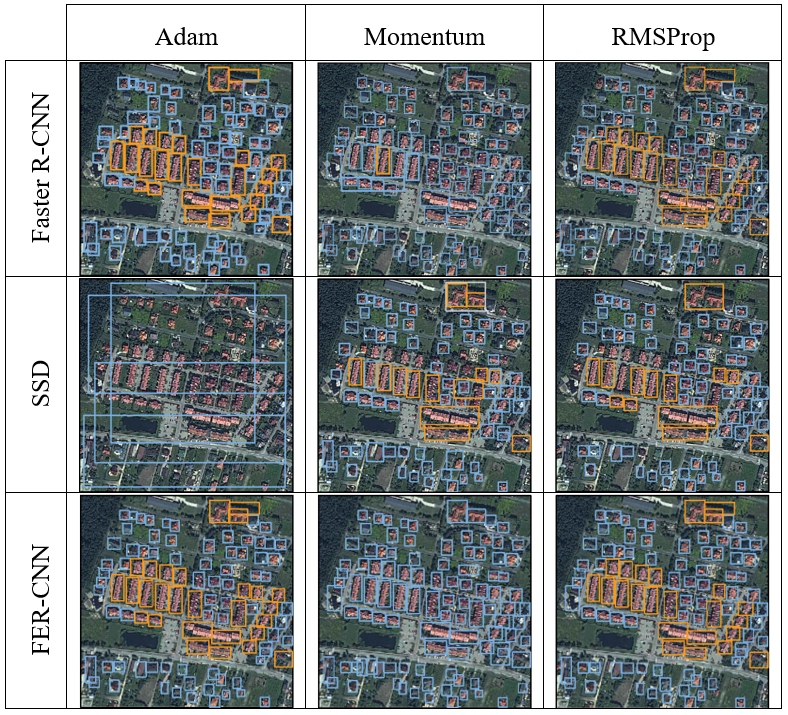
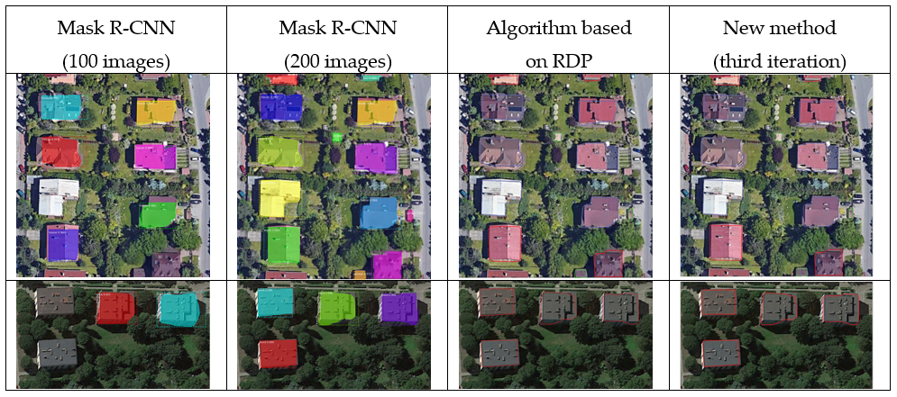

# Detection, classification and boundary regularization of buildings in satellite imagery using Edge Region Convolutional Neural Networks

In this project, in order to improve the accuracy of building detection and classification, we present an FER-CNN algorithm. In addition, we present a new method to improve the detection of the boundaries of detected buildings. The results of this algorithm are compared with those of other methods, such as classical Faster R-CNN with the original VGG16 and the single-shot multibox detector (SSD). An additional advantage of this method is better resistance to shadows, which is a very common issue for satellite images of urban areas.

## Database

The database was created on the basis of satellite images that were obtained using WorldView-2 and Pléiades satellites and show a fragment of the city of Warsaw and its periphery (Poland). Before performing operations on the image, in order to increase their resolution, pan sharpening was performed, which increased the resolution of the multispectral image to 0.5 m. These images were divided into smaller ones that measure 512 x 512 pixels in the vertical step and with a horizontal step equal to 350 pixels. In the resulting database, about 3500 buildings of various types were marked with LabelImg. They were divided into six categories: shopping center, block of flats, church, terraced houses, single-family house and garage.

Acces: [BuildingSatData](https://drive.google.com/drive/folders/1uLWXbuty6vFfM_dyP0vaIOXZPlb2nKR1?usp=sharing)

Algorithms are based on TensorFlow object detection repository located at https://github.com/tensorflow/models

## Results
### Building detection and classification

### Boundaries of detected buildings

